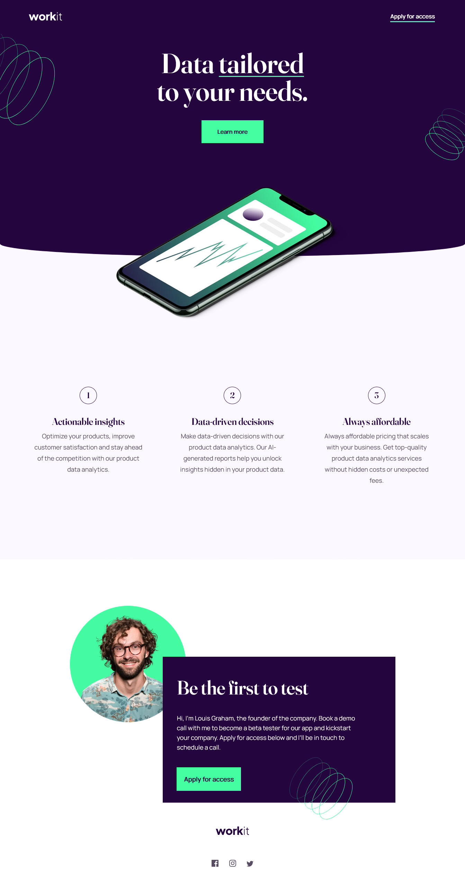
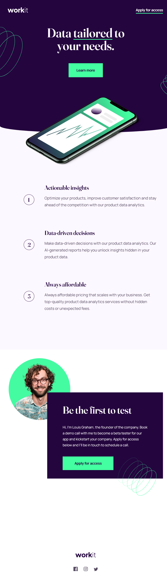
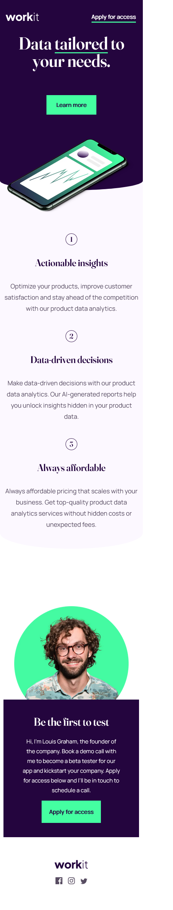

# Frontend Mentor - Workit landing page solution

This is a solution to the [Workit landing page challenge on Frontend Mentor](https://www.frontendmentor.io/challenges/workit-landing-page-2fYnyle5lu). Frontend Mentor challenges help you improve your coding skills by building realistic projects. 

## Table of contents

- [Frontend Mentor - Workit landing page solution](#frontend-mentor---workit-landing-page-solution)
  - [Table of contents](#table-of-contents)
  - [Overview](#overview)
    - [The challenge](#the-challenge)
    - [Screenshot](#screenshot)
    - [Links](#links)
  - [My process](#my-process)
    - [Built with](#built-with)
    - [What I learned](#what-i-learned)
    - [Continued development](#continued-development)
    - [Useful resources](#useful-resources)
  - [Author](#author)

## Overview

### The challenge

Users should be able to:

- Page made with responsive design with breakpoints for smartphones, tablets and desktops 

### Screenshot

### Links

- Solution URL: [GitHub repository](https://github.com/gDABLIUolf/workit-landing-page.git)
- Live Site URL: [site URL](https://willowy-baklava-f18268.netlify.app)

## My process

### Built with

- Semantic HTML5 markup
- CSS custom properties
- CSS Grid
- Mobile-first workflow

### What I learned

For this project I've decided to practice the CSS grid for the responsiveness, using the mobile-first concept for better performance in small devices.

### Continued development

In the future I will definitively continue using the css grid layout, I realy liked how the page turned out, and of course aways using mobile-first concept.

### Useful resources

- [CSS Grid](https://www.w3schools.com/css/css_rwd_grid.asp) - This helped me understanding the RWD and realy liked the results.
 
## Author

- Frontend Mentor - [@gDABLIUolf](https://www.frontendmentor.io/profile/gDABLIUolf)
